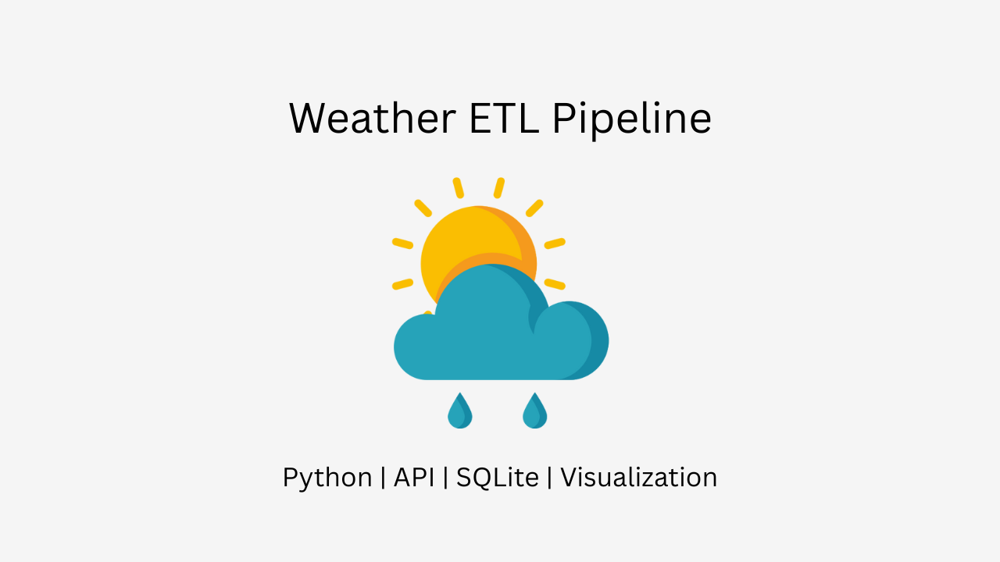

# 🌤 Weather ETL Project

This project collects weather data from OpenWeather API, stores it in SQLite, performs basic analysis, and visualizes temperature trends.

## 🔧 Features

- Fetches real-time weather for a given city
- Stores results in a local SQLite database
- Performs SQL analysis (avg/max temperature, weather types)
- Visualizes temperature over time using matplotlib

## 📦 Technologies

- Python
- Requests
- SQLite3
- Matplotlib
- dotenv

## 🚀 How to run

1. Clone the repository
2. Add your `.env` file:
    ```env
    API_KEY=your_api_key_here
    CITY=Tashkent
    UNITS=metric
    LANG=en
    ```
3. Run the pipeline:

```bash
python main.py
